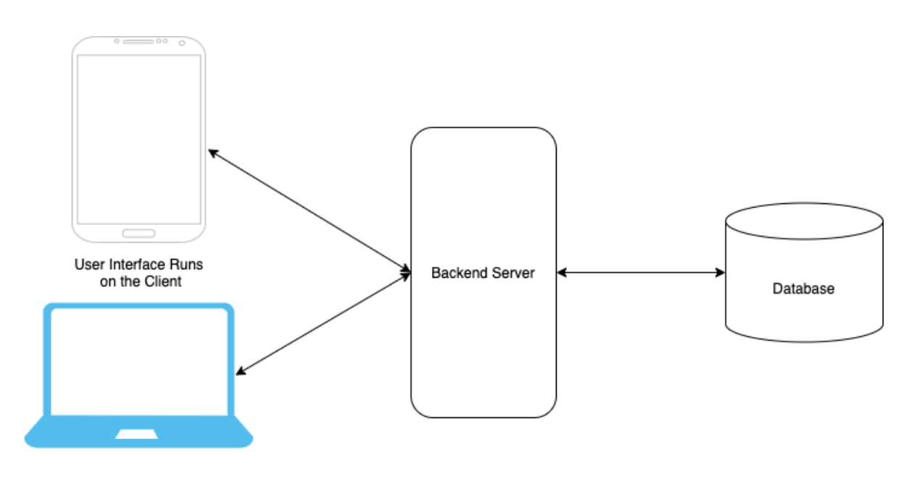
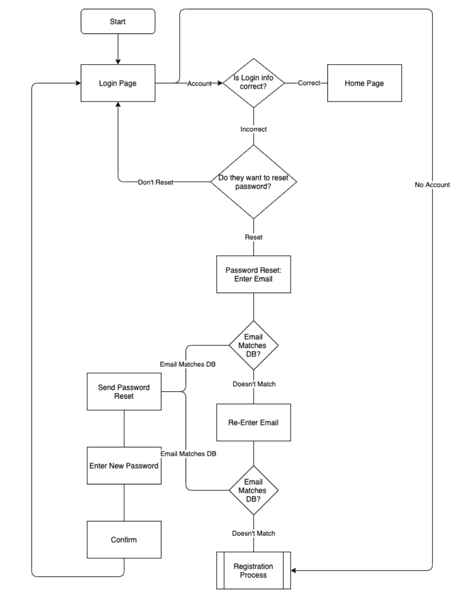
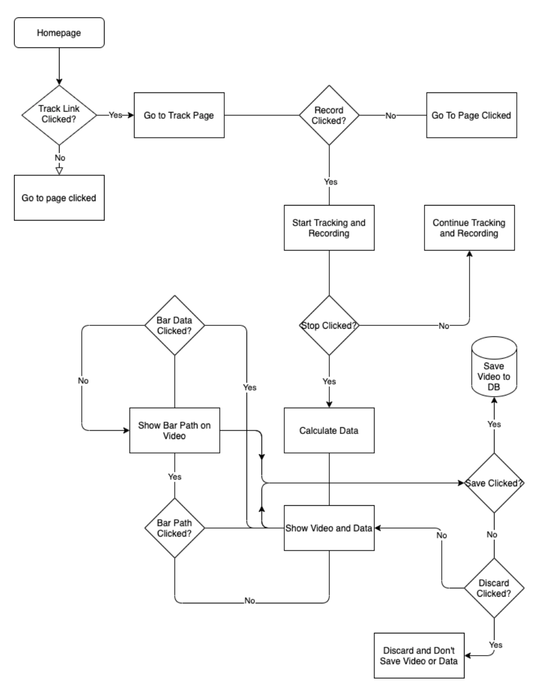
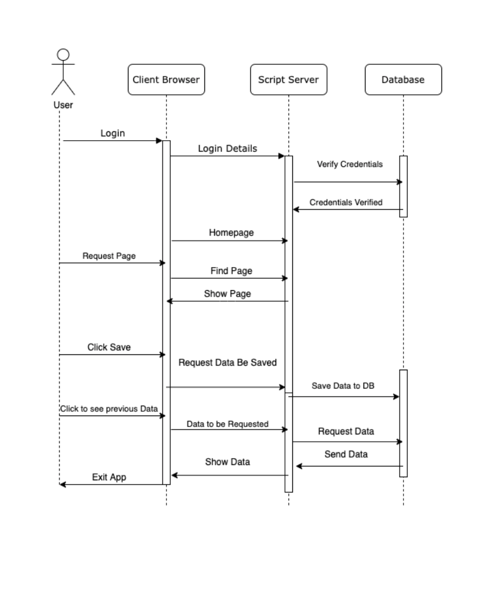
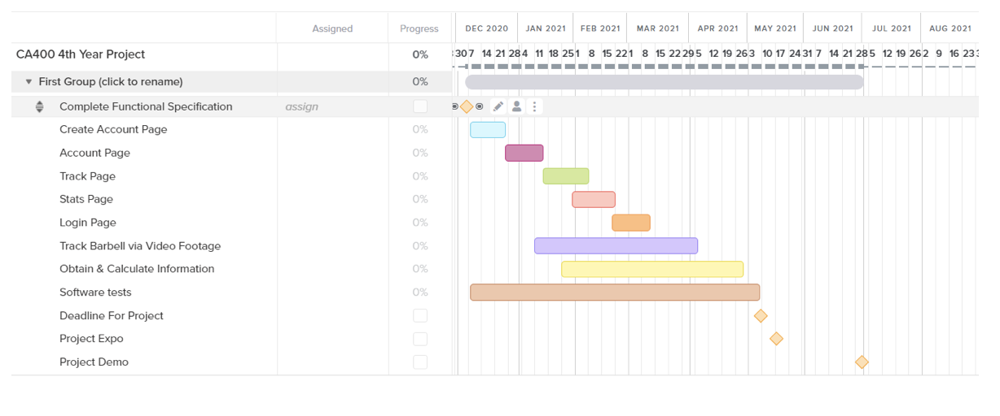

Functional Specification

Barbell Tracker

Jordan Voss - 17327513

Nathan Ndombasi - 13517227

Supervisor - Alistair Sutherland

4/12/2020

Functional Specification Contents

1 [Introduction](#-1.-Intro)

1.1 [Overview](#-1.1-Overview)

1.2 [Business Context](#-1.2-Business-Context)

1.3 [Glossary](#-1.3-Glossary)

2 [General Description](#-2-General-Description)

2.1 [System Functions](#-2.1-System-Functions)

2.2 [User Characteristics and Objectives](#-2.2-User-Characteristics-and-Objectives)

2.3 [Operational Scenarios](#-2.3-Operational-Scenarios)

2.4 [Constraints](#-2.4-Constraints)

3 [Functional Requirements](#-3-Functional-Requirements)

3.1 [Login](#-3.1-Login)

3.2 [Track Barbell](#-3.2-Track-Barbell)

3.3 [Track Body Parts](#-3.3-Track-Body-Parts)

3.4 [Obtain and Show Data](#-3.4-Obtain-and-Show-Data)

3.5 [Use User Input With Gathered Data to Generate Custom Values](#-3.5-Use-User-Input-With-Gathered-Data-to-Generate-Custom-Values)

3.6 [Account Editing](#-3.6-Account-Editing)

4 [System Architecture](#-4-System-Architecture)

5 [High-Level Design](#-5-High-Level-Design)

5.1 [Web App Architecture](#-5.1-Web-App-Architecture)

5.2 [User Flow diagram for Login](#-5.2-User-Flow-Diagram-for-Login)

5.3 [User Flow Diagram for Seeing Data from video recorded on app](#-5.3-User-Flow-Diagram-for-Seeing-Data-from-Video-recorded-on-app)

5.4 [Sequence diagram how different aspects interact](#-5.4-Sequence-diagram-how-different-aspects-interact)

6 [Preliminary Schedule](#-6-Preliminary-schedule)

# 1. Intro

 ## 1.1 Overview

Our project will help with personal trainers and clients alike involved
in strength sports such as Powerlifting/Olympic Lifting, field sports
such as Rugby or GAA, and will also be useful for those who train using
the gym as a hobby. We feel it will be useful especially for a coach or
personal trainer who wants to understand more about the gym sessions
their client has, as well as seeing what factors influence the session
of the individual, e.g. Sleep, Nutrition, Hydration, Mood. Our Project
is an app for tracking many factors that come into play when we decide
to take the leap into the world of the gym, in particular weights. From
bar speed, velocity and path, to other factors outside of the gym such
as quality of sleep, nutrition and hydration on the day of/before
training day.

Our project will be able to recognise the end of a barbell through
either live video recording, or uploaded video. We are unsure of which
method we will use, but at the minute our two options are to have 1. A
circular piece of paper, a colour vastly different to the user's
background that our system will know the size off, as the circular ends
of the barbell are consistent across the world. From this, our system
can determine the pixels per metre on the screen, and while tracking the
movement of the barbell can determine data such as bar speed, bar path,
velocity etc. and help to determine the RPE of a set.

Our project will also be able to determine the key point on the body
that are factors in RPE becoming harder/easier than expected, i.e. back
rounding making it harder, or weight shifting, making it easier, both of
which however, are conducive to higher injury risk.

The term known commonly as RPE (Rate of Perceived Exhaustion) which
essentially rates the difficulty/10 of the set just completed by an
athlete (How many more reps could I have completed? etc.). Many sports,
but, primarily in Powerlifting and Olympic Lifting, use these techniques
in order to keep training at a certain intensity for the individual for
the quickest and most efficient ways of gaining strength. This RPE is
very individual, so, starting off with a default speed and velocity we
will determine an RPE of a set for the individual. As time goes on
however the app will take input from the individual, as a set may move
as slow as an RPE 9/10 (Implying the athlete thinks they could only have
completed 1 more rep), but in terms of how it felt for the athlete, they
may have felt there was more \'in the tank\' so perhaps it was an RPE 8
for them. By examining the trends in their lifts, and their own input on
how the set felt, we can use this date to extract some customised RPE -
speed mappings. By default an average athlete will have a bar speed of
0.7m/s when a set is an RPE 8, however thanks to inputs from the user,
we know that generally the speed of the bar when they lift at RPE 8 is
actually 0.6m/s. This allows for an individualised training approach
which is becoming more and more necessary in the industry as there is no
\'one size fits all\' in terms of programming or RPE.

The path of the bar is another factor that we will take into account
when considering RPE and form checking. Perhaps if an athlete\'s weight
shifts forward and they begin to ascend while squatting, we can see as
we draw the bar path for the individual to see where they are going
wrong, as the bar in a squat should move in a straight line (however
this differs from lift to lift) We can tell the athlete, perhaps this
was an RPE 9 today, although you hit this weight 2 weeks ago at RPE 8,
BUT HERES WHY. This can be extremely useful for both veterans of the
sports and novices or people only pursuing them as a hobby.

Using factors such as sleep, nutrition and hydration will also be able
to help the athlete and/or coach determine why on a particular day, a
weight which normally would be easy for the athlete (RPE 6), becomes an
RPE 8 for no apparent reason. We can encourage the athlete to enter a
rating out of 10 for all of these factors and, determine if today is a
good day for them to train, or should they perhaps eat or hydrate a bit
more before they train, should they save it for another day as a bad
nights sleep could potentially increase injury risk especially when
prescribed a lift at RPE 9. Again, through learning about the individual
and what levels of sleep, hydration and nutrition enables them to
perform at their best. These however will only be recommendations, and
we will include a disclaimer stating the user won't hold us responsible
if they are injured.

## 1.2 Business context

Although we do not have a business organisation sponsoring our project,
we do hope that it would be useful for many sports teams that include
gym routines as part of their training, or for individual use for those
using the gym as a hobby. There are many powerlifting clubs in Ireland
that use the RPE system or determining workout intensity and we feel
that being able to track data for the athletes would be extremely
beneficial for them to get the best out of their athletes in order to
grow their own reputation.

 ## 1.3 Glossary

RPE: Rate of Perceived Exhaustion - The RPE scale is used to measure the
intensity of your exercise. The RPE scale runs from 0 -- 10. The numbers
below relate to phrases used to rate how easy or difficult you find an
activity. For example, 0 (nothing at all) would be how you feel when
sitting in a chair; 10 (very, very heavy) is how you feel at the end of
an exercise stress test or after a very difficult activity. [[Source of
definition]{.ul}](https://my.clevelandclinic.org/health/articles/17450-rated-perceived-exertion-rpe-scale).

# 2 General Description

## 2.1 System Functions

When a user downloads the app they will be prompted to create an account
or login.

Upon successfully logging in, the user will find themselves at the home
page with links to the other pages consisting of **Track**, **Stats**,
**Account**

**Track -** page where the user can upload or record a video, ensure the
app has found the end of the barbell, and then proceed to do their set.
After this the video will be show on the top of the page. With the stats
shown underneath. There will be a button to either show or hide the bar
path drawing on the video, and they can see all sorts of data including,
average speed velocity, form check, and graphs potentially showing the
progress made from the last videos they uploaded. There will be a save
or discard button if they want to save the data or not, and also an
input of what RPE they found the set to be

**Stats -** Here the user will be given options of the different lifts
e.g. squat, bench or deadlift. When each is selected, they will be
presented with the data from their previous attempts at these lifts.
They will also be able to switch between form tracking data and bar
tracking data, enabling them to see if they get less form breakdown
warnings as time goes on, or if their set has sped up or become a lower
RPE over time too.

**Account -** The account section will be where the user can see details
about their account, change their information such as email, username
etc, and see our customised rep charts for them, depending on how often
the system is utilised by them.

## 2.2 User Characteristics and Objectives

The intended users for our project will be gym goers, people
participating in a weightlifting sport, people participating in other
sports in which their training involves gym work, or coaches/Personal
Trainers, who's clients are using the RPE method of training. The users
will need no prior knowledge in computing etc. but may find prior
knowledge on rep and other areas of the fitness industry in order to
better understand the data given back to them.

## 2.3 Operational Scenarios

For our operational scenarios we will use a **Given When Then** syntax,
a Gherkin Reference, which we hope to use for our end to end tests using
cucumber. It is basically a test file that is written in plain English
so it is easy to see where the errors occur e.g. **Given,** a user wants
to record a video **When,** they press record **Then,** the video
records. Extra steps in the when section are joined with an '**And'.**

1.  **Given** A user wants to login

**When** they login using their correct credentials

**Then** they are brought to the home page under the correct account
name and info

2.  **Given** A user want to record a video

**When** they login with their correct credentials **and** navigate to
track **and** press record video

**Then** they see the video has started to record

3.  **Given** A user want to see the barbell is being tracked before
    they start their set

**When** they login with their correct credentials **and** navigate to
track **and** select record video

**Then** they will see confirmation the barbell has been found and is
being tracked

4.  **Given** A user wants to save a video to their account

**When** they login with their correct credentials **and** navigate to
track **and** record a video **and** click save

**Then** the video and its data are saved to their account

5.  **Given** The user wants to see the bar path of their uploaded video

**When** they login with their correct credentials **and** navigate to
track **and** upload a video **and** click see bar path

**Then** the bar path is drawn for them on the video

6.  **Given** A user wants to see the data for the video just uploaded

**When** they login with their correct credentials **and** navigate to
tracking **and** upload a video

**Then** the data for the video can be seen underneath the video

7.  **Given** A user wants to tell our system what rep they found the
    set to be

**When** they login with their correct credentials **and** navigate to
tracking **and** record a video

**Then** they can type their proposed RPE value into the text box

8.  **Given** A user wants to see the bar data for the deadlift recorded
    yesterday

**When** they login with their correct credentials **and** navigate to
stats **and** click deadlift **and** click the instance of the deadlift
they want stats for

**Then** they will see stats for the set in question

9.  **Given** A user wants to see form stats for their squat recorded
    last week

**When** they login with their correct credentials **and** navigate to
stats **and** click squat **and** click on the instance of the squat
they want stats for **and** click form stats

**Then** they will see form stats for the set in question

10. **Given** A user wants to see their account information

**When** they login with their correct credentials **and** navigate to
account **and** click info

**Then** they are presented with their account information

11. **Given** A user wants to change their username

**When** they login with their correct credentials **and** navigate to
account **and** click info **and** click change username

**Then** they input their new username and the database is updated with
this information

12. **Given** A user wants to see their own custom RPE chart.

**When** they login with their correct credentials **and** navigate to
account **and** click info **and** click RPE

**Then** they can see their own customised rep chart

## 2.4 Constraints

**Time** will be a major constraint for this project as the deadline is
in the month of May. As the project grows we can only hope that we don't
run into too many time consuming problems and our project will be fully
functional before the due date. The more constraints we face in time,
the higher the potential risks are, as the project will end up being
rushed.

**Experience and Prior Knowledge** will be another constraint for us.
Neither of us have worked with image processing before or object
tracking, so this will be a new area for us to venture into. Jordan has
some prior knowledge around RPE and how the data is relevant to our
system, but Nathan has not done these kinds of things before, so
learning this will also eat into our time constraint a little bit,
however we are confident he will be able to understand only the
necessary areas of this fairly quickly.

**Database Memory** may also be an issue, storing names, details, and
lots of data for each lift may take a toll on our memory limits, so we
will need to look into how much memory we can get for free and if we can
use this, or if we need to upgrade our memory wherever we decide to
store it.

# 3 Functional Requirements

## 3.1 Login

**Description**

The system must be able to identify the correct user login and redirect
the user to the appropriate page. We will need to store all of the
users' info in a database in order to determine a login.

**Criticality**

Medium

**Technical Issues**

Ensuring the user logs into the correct account when they log in

**Dependencies**

Must interact with he account management part of the app

## 3.2 Track Barbell

**Description**

The system must be able to identify the barbell, size of it and track it
gathering the speed, velocity and path of the bar along the way

**Criticality**

High

**Technical Issues**

Ensuring the system tracks the barbell accurately and only the barbell,
we don't want it to track other things in the gym

**Dependencies**

Interacts with the stats section as without this data we will have no
stats to show

## 3.3 Track body parts

**Description**

The system must recognise body parts within the video ankles, knees,
shoulders etc

**Criticality**

High

**Technical Issues**

Ensuring it doesn't track other people who may be in the background and
get calculations wrong from this

**Dependencies**

Interacts with the stats section as without this data we will have no
stats to show

## 3.4 obtain and show data

**Description**

Obtain data given from the barbell and form trackers and then display
them in way that would be beneficial to the user.

**Criticality**

High

**Technical Issues**

Ensuring we get the right data from the right aspect of the system, e.g.
speed from barbell tracker and form data from the form tracker

**Dependencies**

Dependent on the form tracker and barbell tracker to get the data and
then show the data in way that will be useful for the user

## 3.5 Use User Input With Gathered Data to Generate Custom Values

**Description**

Incorporate the data gathered from multiple videos to generate custom
RPE with the data input by the user determining how they felt the set
went (regression perhaps?)

**Criticality**

High

**Technical Issues**

Ensure the regression is correct, and not giving values that are
impossible, eg moving at 10m/s for an RPE 7. We should have min and max
values that the bar can travel at and be considered for each RPE

**Dependencies**

This will be dependent on the Barbell tracker getting us the correct
information, and the user providing us with relatively accurate
information on how the set felt to them.

## 3.6 account editing

**Description**

User must be able to change their name, email, password etc.

**Criticality**

Medium

**Technical Issues**

Ensuring there aren't more than one of the same email/username, deleting
previous usernames passwords etc.

**Dependencies**

Dependent on the login screen working correctly and assigning the user
the correct credentials when logged in so they don't change somebody
else's username

# 4 System Architecture

**Frontend** User logs into the account and makes HTTP Requests to get
information from the server side backend and through this retrieves from
the database.

**Server** The server will hold our back end and database, so the UI is
the only thing installed on the client side. If we get as far as making
it possible to install on a phone, this will make it easier, as we had
issues with getting things like bumpy onto a phone in last year's
project, because this will just be accessed by HTTP requests instead of
needing to be installed on a phone.

**Database** We will need to build a database for storing all relevant
data, we can use a popular database such as MongoDB

You can see a diagram for our system architecture in the next section.

# 5 High Level Design

## 5.1 Web App Architecture

## 5.2 User Flow diagram for Login

## 5.3 User Flow Diagram for Seeing Data from video recorded on app

## 5.4 Sequence diagram how different aspects interact

# 6 Preliminary Schedule

