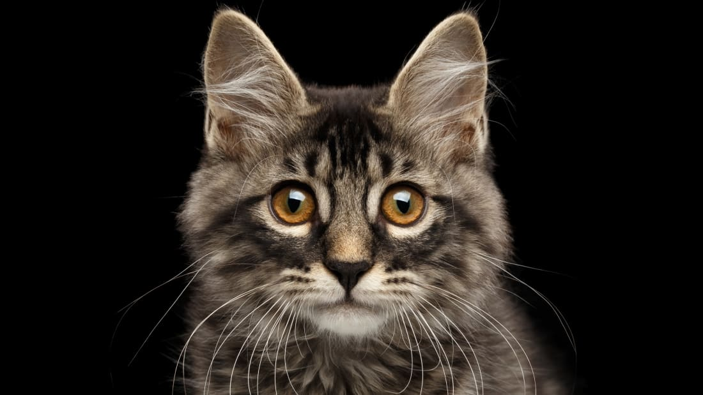

  # School of Computing &mdash; Year 4 Project Proposal Form

## SECTION A

|                     |                   |
|---------------------|-------------------|
|Project Title:       | Barbell Tracker         |
|Student 1 Name:      | Jordan Voss          |
|Student 1 ID:        | 17327513            |
|Student 2 Name:      | Nathan Ndombasi           |
|Student 2 ID:        | 13517227            |
|Project Supervisor:  | Alistair Sutherland           |

## SECTION B

### Introduction

> Our project is an app that will help with personal trainers and clients alike  involved in strength sports such as Powerlifting/Olympic Lifting, field sports such as Rugby or GAA, and will also be useful for those who train using the gym as a hobby. We feel it will be useful especially for a coach or personal trainer who wants to understand more about the gym sessions their client has, as well as seeing what factors influence the session of the individual, e.g. Sleep, Nutrition, Hydration, Mood. 

### Outline

> Our Project is an app for tracking many factors that come into play when we decide to take the leap into the world of the gym, in particular weights. From bar speed, velocity and path, to other factors outside of the gym such as quality of sleep, nutrition and hydration on the day of/before training day.\
> The app will make use of a term known commonly as RPE (Rate of Perceived Exhaustion) which essentially rates the difficulty/10 of the set just completed by an athlete (How many more reps could I have completed? etc.). Many sports, but, primarily in Powerlifting and Olympic Lifting, use these techniques in order to keep training at a certain intensity for the individual for the quickest and most efficient ways of gaining strength. This RPE is very individual, so, starting of with a default speed and velocity we will determine an RPE of a set for the individual. As time goes on however the app will take input from the individual, as a set may move as slow as an RPE 9/10 (Implying the athlete thinks they could only have completed 1 more rep), but in terms of how it felt for the athlete, they may have felt there was more 'in the tank' so perhaps it was an RPE 8 for them. By examining the trends in their lifts, which will be separated to determine different RPE speed values for each individual lift, as well as each individual person, the app can learn that, by default an average athlete will have a bar speed of 0.7m/s when a set is an RPE 8, however thanks to inputs from the user, we know that generally the speed of the bar when they lift at RPE 8 is actualy 0.6m/s. This allows for an individualised training approach which is becoming more and more necessary in the industry as there is no 'one size fits all' in terms of programming or RPE. \
> Using factors such as sleep, nutrition and hydration will also be able to help the athlete and/or coach determine why on a particular day, a weight which normally would be easy for the athlete (RPE 6), becomes an RPE 8 for no apparent reason. We can encourage the athlete to enter a rating out of 10 for all of these factors and, determine if today is a good day for them to train, or should they perhaps eat or hydrate a bit more before they train, should they save it for another day as a bad nights sleep could potentially increase injury risk especially when prescribed a lift at RPE 9. Again, through learning about the individual and what levels of sleep, hydration and nutrition enables them to perform at their best\
> The path of the bar is another factor  that we will take into account when considering RPE and form checking. Perhaps if an athlete's weight shifts forward and they begin to ascend while squatting, we can see as we draw the bar path for the individual to see where they are going wrong, as the bar in a squat should move in a straight line (however this differs from lift to lift) We can tell the athlete, perhaps this was an RPE 9 today, although you hit this weight 2 weeks ago at RPE 8, BUT HERES WHY. This can be extremely useful for both veterans of the sports and novices or people only pursuing them as a hobby. \
> The athlete will be able to track his/her progress as they go on, looking back at a deadlift 3 reps at RPE 8 in 2019 with 150kg and compare bar speed, path, slowest rep, fastest rep, rep with the most efficient path from their set in 2020 with 170kg. They can also see that they were more prepared for the session in 2020 as they had rated their sleep 8.5/10 compared to the 7/10 in 2019. This will be true for hydration and nutrition aswell. They can also track other important data such as bodyweight.\
> The coach can also keep track of his/her athletes in the app, seeing the progress made by them all over the time spent coaching them and potentially react to a completed set (like on facebook) with a 'like' or 'love' reaction. (This will be time allowing)\

### Background

> The idea came from one of our team members, Jordan, who has been involved with the powerlifting club with DCU for the past 3 years. During his time with DCU powerlifting, and other clubs outside of college, he found that all of the things we would be tracking in our app, bar speed, path and velocity, sleep, nutrition, hydration, bodyweight were all tracked too, but there was never a lot done with them, perhaps at a higher, more elite level, these things are tracked with efficiency, but the tools/knowledge of how and what to do with them just don't seem to be there at the more amateur levels. They track all of the data, and find it useful in terms of why a session went wrong, but it is very hard to compare the movement of a set 2 years ago with today's set unless you know exactly what you are looking for. With our visualised data, the user can search/scroll back through past sets and compare them\
>Our project aims to help coaches and athletes alike have a place where all of this data is strored and can be easily comparable with visualised data for all users and ability to compare improvements session to session, week to week and so on.\

### Achievements

> The project will provide functionality to coaches and athletes to be accurately able to see progress made over time. It can help to fix errors in form, weaknesses in diet or recovery, and determine what the individual's customised RPE bar speeds/velocities are.\
> The project will also help in tracking factors such as bodyweight, mood, fatigue levels, quality of sleep etc. and thus, can tell when, after a particularly long/intense block of training the athlete may need a rest, i.e. sleep levels are decent but fatigue levels/motivation to train is quite low. We will be able advise athletes when their bodies are tired or insufficiently fueled to complete a workout or if they do decide to train, we advise them that injury risk may be higher than other session.
> Ultimately our project will provide a platform for coaches and their athletes to track progress and see where weaknesses are in their current training programme, helping the athlete focus on form, staying fueled and hydrated, and recovering optimally, and allowing the coach to see what exercises and intensities are working for the athlete when it comes to achieving their goals.

### Justification

> The project will be useful for both coaches and athletes while the athlete is following a structured training programme with the coach. It will provide the coach with useful information in order to get the most progress out of their client, seeing where a breakdown in form happens and perhaps reducing load/intensity accordingly (which our project can suggest) \
> It will be useful also for the athlete, as they can see their own progress, know when injury risk is at its highest before a session, therefore decreasing the injury risk as they know maybe they should take it a bit easier or perhaps not train at all.

### Programming language(s)

> Python, SQL, JS/TypeScript

### Programming tools / Tech stack

> React - UI, Flask, OpenCV, OpenPose - Backend for video recording, uploading and object detection, Other Python Libraries for AI/Machine Learning SQLAlchemy

### Hardware

> Android/IPhone

### Learning Challenges

> Mobile App Development, AI/Machine Learning

### Breakdown of work

#### Student 1
> Jordan Voss

> Python Flask Backend, OpenCV, OpenPose
> Portion of AI work
> Portion of Database Work

#### Student 2

> Nathan Ndombasi

> React UI
> Portion of AI work
> Portion of Database Work

### Although these are what are designated to each student, it may happen that we each do some part of the UI/Python Backend if needed too.

## Example

> Example: Here's how you can include images in markdown documents...

<!-- Basically, just use HTML! -->

  

